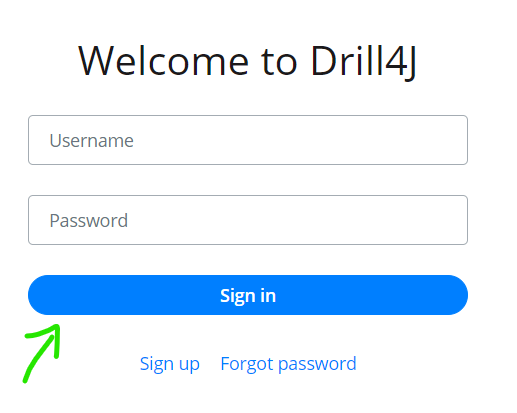
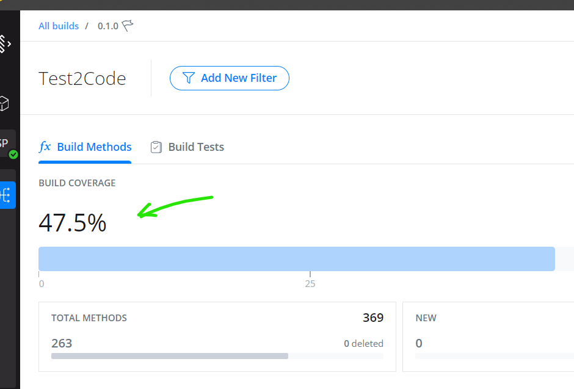
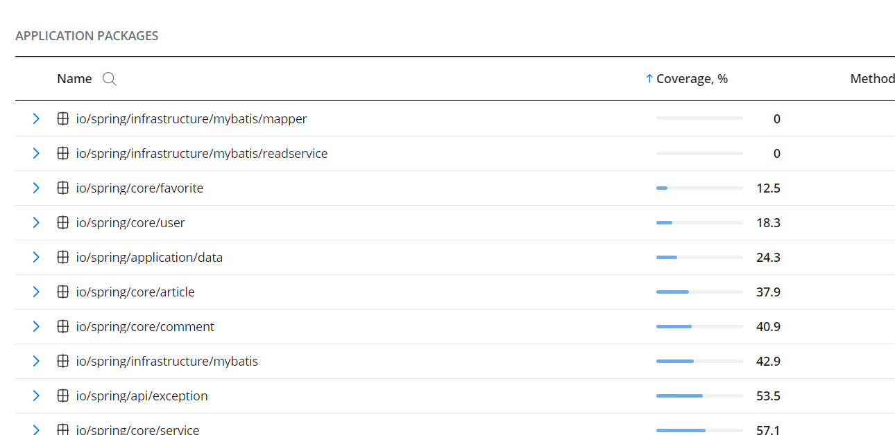
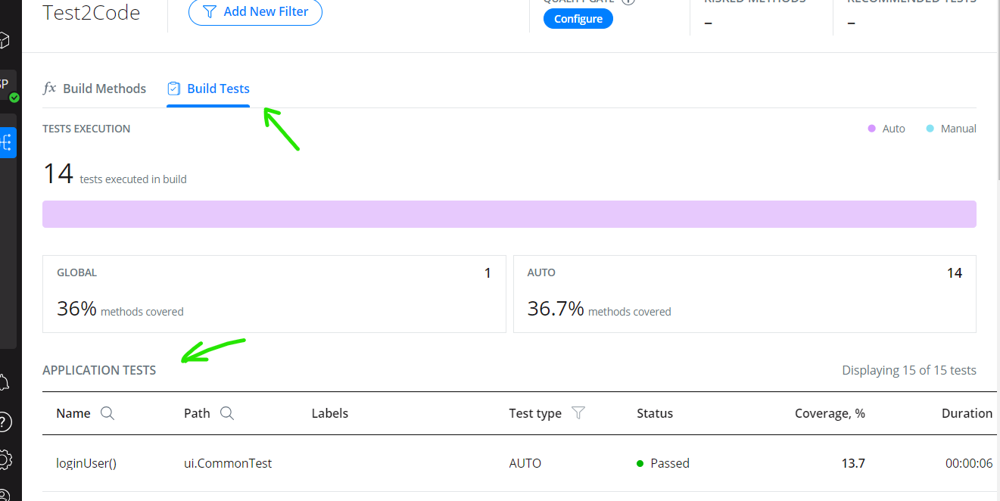
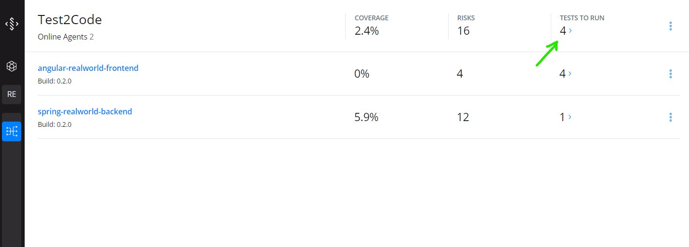
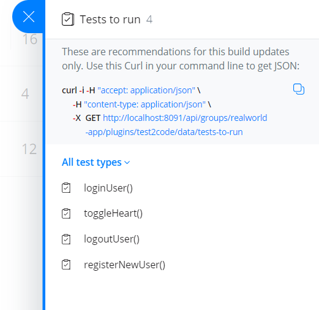
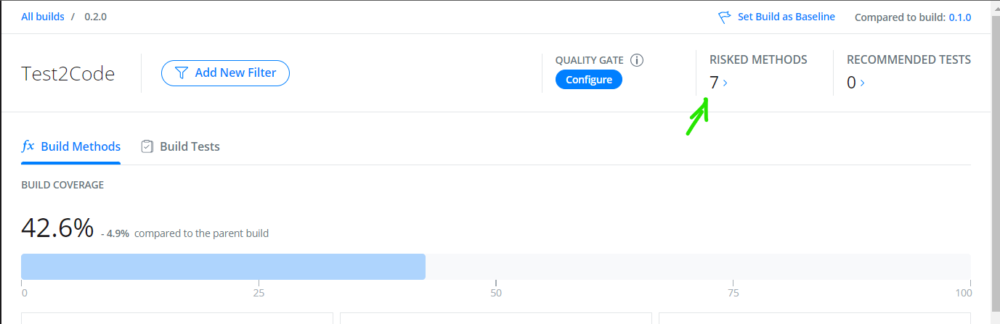

# Drill4J Demo

This repository demonstrates how Drill4J introduces continuous feedback into SDLC and enables Test Gap and Test Impact Analytics.

Drill4J Agents are integrated with both Java backend and JavaScript web app to provide metrics collected during E2E UI Selenium tests execution. (_Drill4J is not limited to e2e tests, these are emplyed here for the demo's sake_)

Features:
1. _Coverage report_ - get detailed test coverage picture for each component of *App Under Test*

2. _Risks_ - get a complete view of _New_ or _Modified_ code. See if its been tested or not.

3. _Recommended tests_ - get tests suggestions based on detected _Risks_. Minimize efforts on regression testing - find failures faster.

__WARNING__: This demo works only on Windows 10/11

__KNOWN ISSUE__: [Drill4J Admin Panel](http://localhost:8091) may display incomplete data if it is opened in multiple tabs at the same time. Please close previous tabs if you open new ones (i.e. when using direct links from this guide)

__NOTICE__: This is not an installation guide. It is created with needs of demo in mind, hence some topics left untouched (notably - proper CI/CD integration). 
 For the installation instructions, please refer to the documentation on [Drill4J Website](https://drill4j.github.io/docs/installation/setup) 

## Setup overview

1. The demo is based on [RealWorld example app](https://codebase.show/projects/realworld).
    Its a simple pet project that will serve as App Under Test.

2. Its key components ([backend](https://github.com/Drill4J/spring-boot-realworld-example-app) and [frontend](https://github.com/Drill4J/angular-realworld-example-app)) are integrated with Drill4J Agents to record code execution data during tests.

3. This data is sent to [Drill4J Backend Admin](http://localhost:8091) that tracks changes in application and produces metrics (_Coverage_, _Risks_, _Recommended tests_)  

4. _Recommended tests_ are fed back into test automation scripts via [gradle task](./test2run.gradle) to enable execution of only necessary tests

5. [Drill4J Admin Panel](http://localhost:8091) provides an overview of collected data and metrics.

## Running demo

### Prerequisites

1. [Docker](https://www.docker.com/) - to run App Under Test and Drill4J services
2. [Java 8/1.8](https://www.oracle.com/java/technologies/downloads/) or later - to execute automated e2e Selenium tests
3. [Git](https://git-scm.com/downloads) - to clone the repository and launch test commands 

### Clone repository

Open `Git Bash` terminal. Navigate to the directory of your choice and run the following commands:

```shell
git clone https://github.com/Drill4J/realworld-java-and-js-coverage.git;
cd realworld-java-and-js-coverage
``` 

### Deploy Drill4J services and Realworld application

1. Execute the following command to start Drill4J services and deploy Realworld application

    ```shell
    ./demo-up.sh
    ```

    Wait for the script to launch services and download necessary dependencies.
    __It may take a while__ depending on your internet connection (anywhere from 2 to 10 minutes)

    If you see no visible progress try pressing `Enter` key in terminal to force it to update

    You should see the following output, when process is completed:

    ```
    Drill4J Admin Panel is available at http://localhost:8091
    Example application is available at http://localhost:8080 (wait a few seconds for it to become available)
    ```

    > If your internet connection is too slow, example application might fail to start.
    > 
    > Simply wait for script to finish downloading dependencies
    > 
    > And then run `./demo-up.sh` again 

2. Open [Frontend Example Application](http://localhost:8080). You should see the following page
    

    If you see that everything is ok. No actions required on your part here.

3. Open [Drill4J Admin Panel](http://localhost:8091)

4. You should be greeted with "Welcome to Drill4J" page and a login form.

    - Enter `admin` in both username and password fields
    - Press "Sign in" button

    
    
5. Close analytics form (it does not really matter whether you agree or not in the demo scenario)

    

6. You should see empty dashboard with `"View Agents"` button.

    

7. Sidebar area should expand and present you with a single `realworld-app` entry. Click the expand icon to see individual App Under Test components
    

8. Click on the `spring-realworld-backend` entry.

    

    You'll be navigated to the respective component overview page. Click on "Go to Plugin" button to get to the detailed dashboard.
    

9. You should see detailed dashboard view.
    

    This page displays metrics for the respective _Application Under Test_, but its not much too look at just yet.
    First, we have to run tests.

### Run E2E tests for the **1-st** Application Under Test version

It is time to launch our tests. Since this demo does not have "real" CI/CD environment like Github Actions, TeamCity or even Jenkins we'll have to do it manually

1. Run the following command

    ```shell
    ./gradlew clean :build1:test
    ```
   
#### Notice for macOS Users
```
    When running tests on macOS for the first time, you may encounter an issue with launching Chromium. To ensure successful execution of Chromium, it's necessary to grant permission for apps from an unidentified developer.
    Additionally, you will need to explicitly allow Chromium to run by navigating to:  
    System Settings -> Privacy & Security -> Chromium -> "Open anyway"
    This step is crucial to bypass macOS's default security measures for applications downloaded from sources not recognized by Apple.
```

2. Wait for the tests to be executed. It should take from 3 to 5 minutes. Once tests are done you'll see the following log:
    

### Analyze collected metrics

Now lets see metrics Drill4J has collected.

Open the `spring-realworld-backend`'s [dashboard page](http://localhost:8091/agents/spring-realworld-backend/plugins/test2code/builds/0.1.0/overview?activeTab=methods).

1. First metric you see is the overall _Build coverage_ percentage - this indicates to which extent tests have covered our application. The percentage is calculated based on number of _probes_ - the special "counters" inserted by Drill4J agent into application in runtime. The single method will likely have a lot of those, so its a very granular metric.

    

2. Next you can see _Total Methods_ number and how much of those methos where actually covered. Thats a slightly different view at the same metric.

3. Then, there is a _Application Packages_ table. It contains a detailed coverage report for all packages, classes and methods. You can expand each respective entry to see metrics in finer detail.
    - Notice that you can sort packages by coverage by clicking "Coverage" column title. That sorts packages form least covered to most covered. Its a good starting point to analyze which areas of application require more testing or lack it completely.

    

4. Lastly, there is a _Build Tests_ [tab](http://localhost:8091/agents/spring-realworld-backend/plugins/test2code/builds/0.1.0/overview?activeTab=tests). It presents you with the test-centric view of the collected metrics.
    - Just like with the previous table, click _Coverage_ column to enable sorting. This functionality can be useful to detect wich tests might've become obsolete (if their coverage is marginally low, or even 0%)  

    

> You can see all of the same metrics for the frontend application on `angular-realworld-frontend`'s [dashboard page](http://localhost:8091/agents/angular-realworld-frontend/plugins/test2code/builds/0.1.0/overview?activeTab=methods) 


These are basic metrics Drill4J can infer from a single test run. But more interesting metrics arise when Drill4J detects change in the application.

For that to happen, lets deploy new _Application Under Test_ version

### Deploy the **2-nd** application build

It is time to deploy new Application Under Test build. Think of it as a push to repository or a pull request with the corresponding test environment update.

1. Deploy the 2-nd application build

    ```shell
    ./demo-deploy-build2.sh
    ```

2. Wait for the "New build" notification to appear on the Bell icon in the bottom-left corner of the page

    

3. Click on the "Go to Build" button to explore the new build. See how Drill4J detected new, modified and deleted methods

    

You are now presented with key Drill4J metrics, besides _Coverage_: _Risks_ and _Recommended Tests_


- _Risks_ is a number of methods that were either _Modified_(aka changed) from previous version or are completely _New_. We should probably test them in the first place.
    - You can click on risks number to see the [exact list of changes](
http://localhost:8091/agents/spring-realworld-backend/plugins/test2code/builds/0.2.0/risks). After running the tests, you can get back to this page to see, if tests has actually covered any of those.

- _Recommended tests_ is a list of tests that likely to cover _Modified_ methods. Drill4J "knows" that because it uses data from test runs for previous application versions.

This particular page displays recommended tests just for the _backend_ service, but we'll make use of test recommendation for the application as a whole in the next step.

### Run tests for the **2-nd** application build

It is time to use power of _Recommended Test_ feature. You'll see how Drill4J allows to automatically select minimal test suite.

Since we are running E2E tests we'd like to have the exhaustive list, including tests that will cover both [risks of _frontend_](http://localhost:8091/agents/angular-realworld-frontend/plugins/test2code/builds/0.2.0/risks) and _backend_ services.

For that, we can navigate to so called [_group_ page](http://localhost:8091/groups/realworld-app/plugins/test2code) that displays metrics for the whole application.



Click on _Recommended tests_ number.



That opens panel with example call to _Drill4J API_. 

We've already created `test2run.gradle` task that calls this HTTP endpoint, parses the JSON response with the list of recommended tests and only launches required ones.

1. Lets run those tests

    ```shell
    ./gradlew clean :build2:test2run
    ```

2. Wait for tests to complete

3. Once again, get back to `spring-realworld-backend` [dashboard page](http://localhost:8091/agents/spring-realworld-backend/plugins/test2code/builds/0.1.0/overview?activeTab=methods) and `angular-realworld-frontend` [dashboard page](http://localhost:8091/agents/angular-realworld-frontend/plugins/test2code/builds/0.1.0/overview?activeTab=methods)

4. Take a look at _Risks_ metric. See how number of _Risks_ decreases, but there are still some left.
    
    

    Drill4J checks whether executed tests actually covered changed introduced with the new _Application Under Test_ version

    You can click on the _Risks_ number, to see [which risks were not covered](http://localhost:8091/agents/spring-realworld-backend/plugins/test2code/builds/0.2.0/risks) 

    This is a good metric to build Quiality Gates from. If by the end of the testing the number of _Risks_ reached `0` you can confidently tell you have checked all changes one way or the other.

## Finishing demo

This briefly covers features Drill4J provides for automation testing, but one have to remember Drill4J is not limited to UI Selenium tests.

Drill4J also supports API tests, manual tests, unit tests (see full list of supported frameworks in [Documentation](https://drill4j.github.io/docs/overview/why-drill4j)).

In terms of platforms, Drill4J also provides .NET agent, besides Java and JavaScript capabilities demonstrated with this repo

__As told before__ this demo should not be used as installation guide. It is crafted with needs of demo in mind, hence some topics left untouched (notably - proper CI/CD integration). Please refer to our website for a proper getting started intro.

## Manual testing

If you would also like to try manual testing capabilities of Drill4J refer to [Documentation](https://drill4j.github.io/docs/installation/setup-browser-extension) for information on how to install Browser Extension (for Chrome and Chromium-based browsers only)

You can try Drill4J Browser Extension in action on [Realworld App](http://localhost:8080) page - try launching test sessiom with extension, click on the page, execute actions such as Sign up and Sign in and then see the results in Drill4J Admin Panel 

## Teardown

1. To remove demo setup run

  ```shell
  ./demo-down.sh
  ```
