# Drill4J Demo

This repository demonstrates how Drill4J introduces continuous feedback intro SDLC.

Drill4J Agents are integrated with both Java backend and JavaScript web app to provide metrics collected during E2E UI Selenium tests execution. (_Drill4J is not limited to e2e tests, these are emplyed here for the demo's sake_)

Features:
1. _Coverage report_ - get detailed test coverage picture for each component of *App Under Test*

2. _Risks_ - get a complete view of _New_ or _Modified_ code. See if its been tested or not.

3. _Recommended tests_ - get tests suggestions based on detected _Risks_. Minimize efforts on regression testing - find failures faster.

__WARNING__: This demo works only on Windows 10/11

__NOTICE__: This is not an installation guide. It is created with needs of demo in mind, hence some topics left untouched (notably - proper CI/CD integration). 
 For the installation instructions, please refer to the documentation on [Drill4J Website](https://drill4j.github.io/docs/installation/drill-admin) 

## Setup overview

1. The demo is based on [RealWorld example app](https://codebase.show/projects/realworld).
    Its a simple pet project that will serve as App Under Test.

2. Its key components ([backend](https://github.com/Drill4J/spring-boot-realworld-example-app) and [frontend](https://github.com/Drill4J/angular-realworld-example-app)) are integrated with Drill4J Agents to record code execution data during tests.

3. This data is sent to [Drill4J Backend Admin](http://localhost:8091) that tracks changes in application and produces metrics (_Coverage_, _Risks_, _Recommended tests_)  

4. _Recommended tests_ are fed back into test automation scripts via [recommendedTests.gradle](./recommendedTests.gradle) task to enable execution of only necessary tests

5. [Drill4J Admin Panel](http://localhost:8091) provides an overview of collected data and metrics.

## Running demo

### Prerequisites

1. [Docker](https://www.docker.com/) - to run App Under Test and Drill4J services
2. [Java 8/1.8](https://www.oracle.com/java/technologies/downloads/) or later - to execute automated e2e Selenium tests
3. [Git](https://git-scm.com/downloads) - to clone the repository and launch test commands 

### Clone repository

Open `Git Bash` terminal. Navigate to the directory of your choice and run the following commands:

```shell
git clone https://github.com/Drill4J/realworld-java-and-js-coverage.git;
cd realworld-java-and-js-coverage
``` 

### Deploy Drill4J services and Realworld application

1. Execute the following command to start Drill4J services and deploy Realworld application

    ```shell
    ./demo-up.sh
    ```

    Wait for the script to launch services and download necessary dependencies.
    __It may take a while__ depending on your internet connection (anywhere from 2 to 10 minutes)

    If you see no visible progress try pressing `Enter` key in terminal to force it to update

    You should see the following output, when process is completed:

    ```
    Drill4J Admin Panel is available at http://localhost:8091
    Example application is available at http://localhost:8080 (wait a few seconds for it to become available)
    ```

2. Open [Frontend Example Application](http://localhost:8080). You should see the following page
    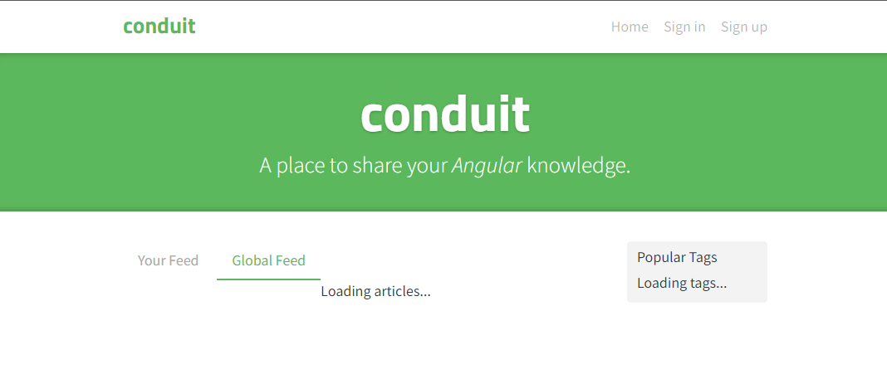

    If you see that everything is ok. No actions required on your part here.

3. Open [Drill4J Admin Panel](http://localhost:8091)

4. You should be greeted with "Welcome to Drill4J" page and a login form. Press "Continue as guest (width admin rights)"

    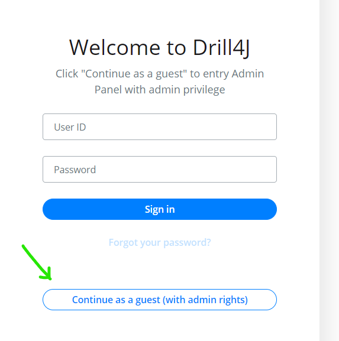

5. Close analytics form (it does not really matter wether you agree or not in the demo scenario)

    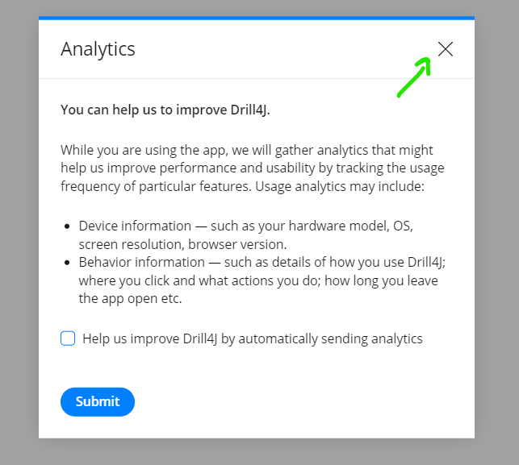

6. You should see empty dashboard with "Select Agent" button. Press it.

    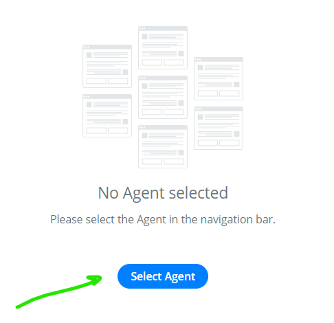

7. Sidebar area should expand and present you with a single `realworld-app` entry. Click the expand icon to see individual App Under Test components
    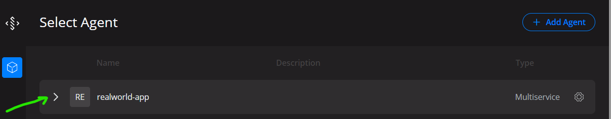

8. Click on the `spring-realworld-backend` entry.

    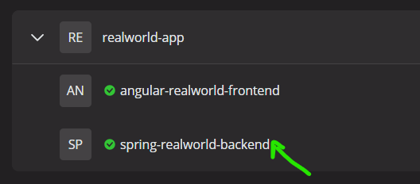

    You'll be navigated to the respective component overview page. Click on "Go to Plugin" button to get to the detailed dashboard.
    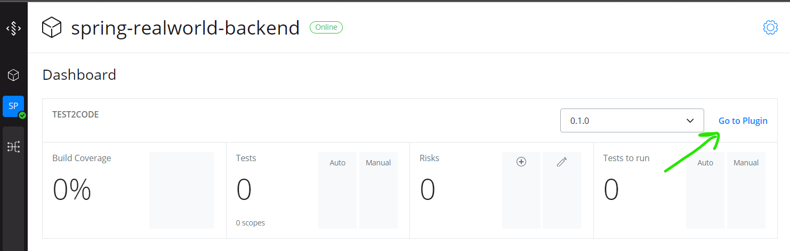

9. You should see detailed dashboard view
    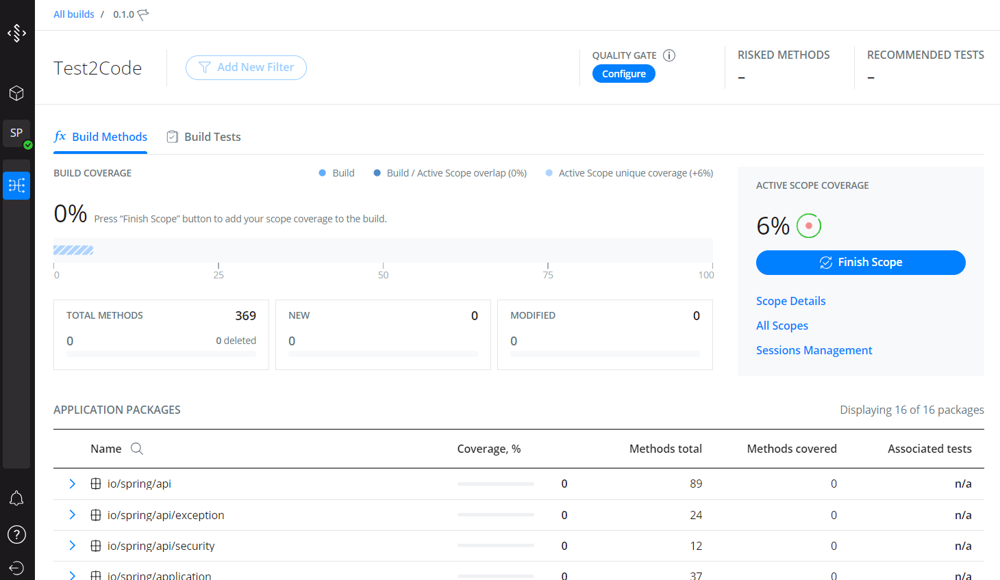

    There is a lot to take in. No need to get into the details yet: 
    1. At the bottom of the page there is a table with Application packages/classes/methods.
    2. To the right there is a `Coverage %` indicator, hinting that Drill4J already collected some coverage data during Application Under Test initialization 
    
    That should be enough for now. We'll get back here later once more data from initial E2E tests run is available.

### Run tests for the **1-st** application build

It is time to launch our tests. Since this demo does not have "real" CI/CD environment like Github Actions, TeamCity or even Jenkins we'll have to do it manually

1. Run the following command

    ```shell
    ./gradlew clean :build1:test
    ```

2. Wait for the tests to be executed. It should take from 3 to 5 minutes. Once tests are done you'll see the following log:
    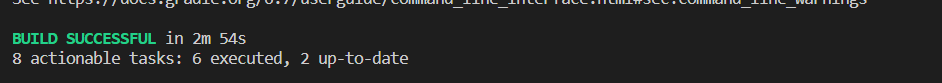

3. Get back to `spring-realworld-backend` [dashboard page](http://localhost:8091/agents/spring-realworld-backend/plugins/test2code/builds/0.1.0/overview?activeTab=methods)
    
4. Press "Finish scope" button
    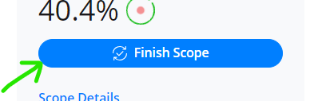

5. Modal window with test run statistics will pop up. Press "Finish scope" to save collected data
    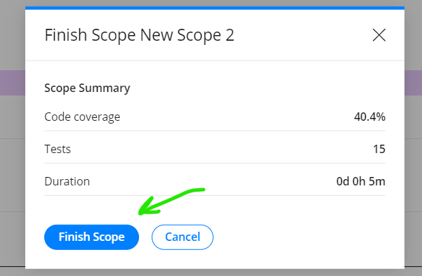

    This action is usually automated with call from CI/CD scripts

6. Navigate to `angular-realworld-frontend` [dashboard page](http://localhost:8091/agents/angular-realworld-frontend/plugins/test2code/builds/0.1.0/overview?activeTab=methods)

### Analyze collected metrics

You can look through both `spring-realworld-backend` [dashboard page](http://localhost:8091/agents/spring-realworld-backend/plugins/test2code/builds/0.1.0/overview?activeTab=methods) and `angular-realworld-frontend` [dashboard page](http://localhost:8091/agents/angular-realworld-frontend/plugins/test2code/builds/0.1.0/overview?activeTab=methods) to see kind of metrics Drill4J has collected from a sigle test run

### Deploy the **2-nd** application build

It is time to deploy new Application Under Test build. This steps corresponds to such events as push to repository/launch of the automation tests that check the new app version.

1. Deploy the 2-nd application build

    ```shell
    ./demo-deploy-build2.sh
    ```

2. Wait for the "New build" notification to appear on the Bell icon in the bottom-left corner of the page
    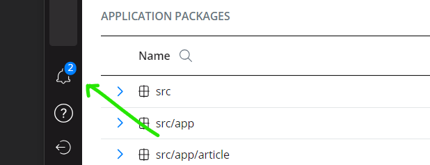

3. Click on the "Go to Build" button to explore the new build. See how Drill4J detected new, modified and deleted methods
    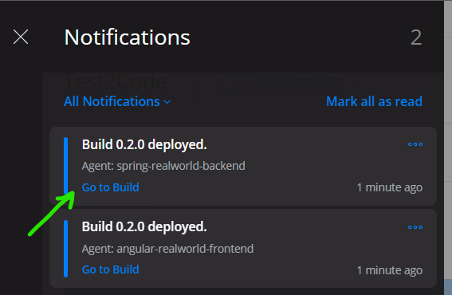

4. You are now presented with key Drill4J metrics, besides _Coverage_: _Risks_ and _Recommended Tests_
    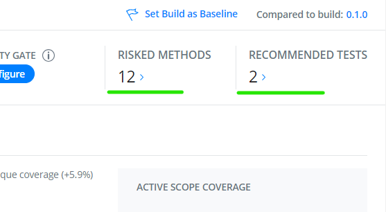

    Simply put, Drill4J tells you which areas of application were change with _Risks_ and tells you how to, likely, do that with _Recommended tests_

    To see it for yourself click on each respective number. Proceed when you are ready

### Run tests for the **2-nd** application build

It is time to use power of _Recommended Test_ feature. You'll see how Drill4J allows to automatically select minimal test suite

1. Run tests by

    ```shell
    ./gradlew clean :build2:test2run
    ```

2. Wait for tests to complete

3. Once again, get back to `spring-realworld-backend` [dashboard page](http://localhost:8091/agents/spring-realworld-backend/plugins/test2code/builds/0.1.0/overview?activeTab=methods) and `angular-realworld-frontend` [dashboard page](http://localhost:8091/agents/angular-realworld-frontend/plugins/test2code/builds/0.1.0/overview?activeTab=methods)

4. Take a look at _Risks_ metric. Now press `Finish scope` button and see how number of _Risks_ decreases

    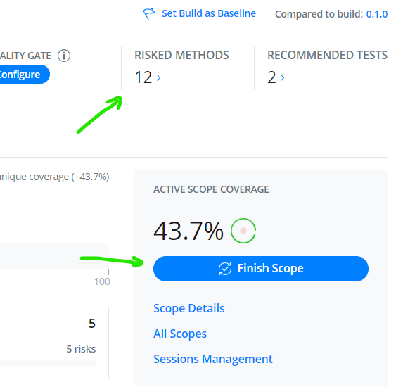

    Drill4J checks whether executed tests actually covered changed introduce with new App Under Test versions

    You can click on the _Risks_ again, to see to which degree they were covered

    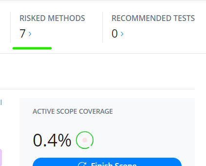

    As you can tell, this is a good ground to build your Quiality Gates from

5. Besides that, detailed coverage report is now available at the bottom of the page:

    Click on column headers to sort entries in the table. This is a great way to find blind spots in App Under Test test coverage

    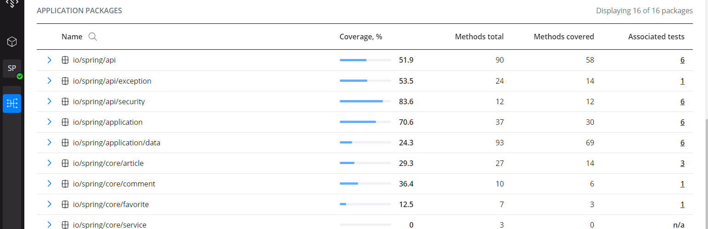

6. Another great feature is `"Test"` tab

    It presents the same data from testing perspective.

    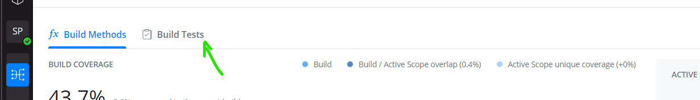

    One can see how broadly and deeply each test has covered the application - with `Coverage %` and `Covered Methods` metrics for each test

    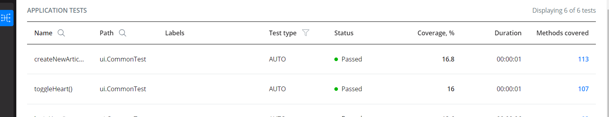

    It can not only serves as a basis for _Recommended Tests_ metric, but also provides common communication ground for the whole team. Everyone can see which tests were executed and if they actually covered the expected features.  

## Finishing demo

This briefly covers features Drill4J provides for automation testing, but one have to remember Drill4J is not limited to UI Selenium tests.

Drill4J also supports API tests, manual tests, unit tests (see full list of supported frameworks on [https://drill4j.github.io/docs](https://drill4j.github.io/)).

In terms of platforms, Drill4J also provides .NET agent, besides Java and JavaScript capabilities demonstrated with this repo

__As told before__ this demo should not be used as installation guide. It is crafted with needs of demo in mind, hence some topics left untouched (notably - proper CI/CD integration). Please refer to our website for a proper getting started intro.

## Manual testing

If you would also like to try manual testing capabilities of Drill4J refer to [https://drill4j.github.io/docs](https://drill4j.github.io/) for information on how to install Browser Extension (for Chrome and Chromium-based browsers only)

You can try Drill4J Browser Extension in action on [Realworld App](http://localhost:8080) page - try launching test sessiom with extension, click on the page, execute actions such as Sign up and Sign in and then see the results in Drill4J Admin Panel 

## Teardown

1. To remove demo setup run

  ```shell
  ./demo-down.sh
  ```
